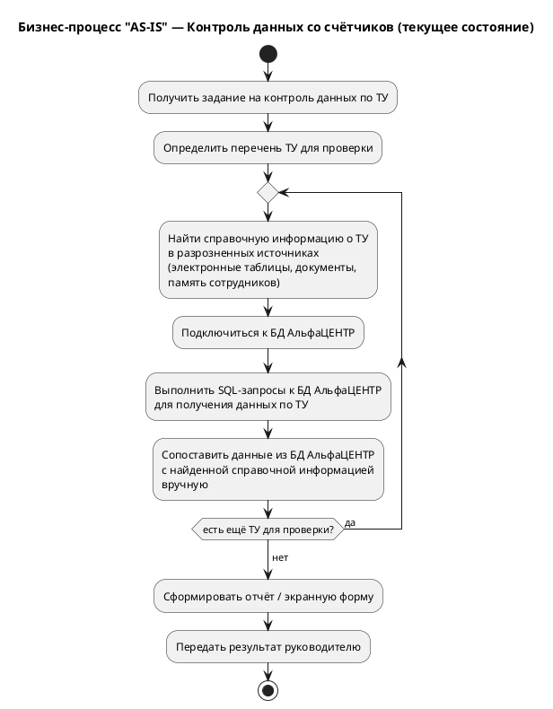
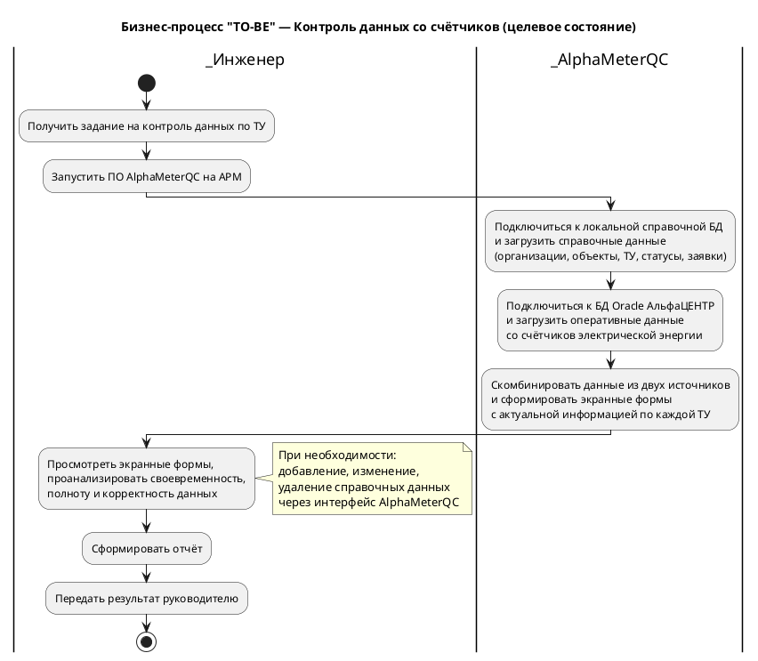

# Анализ бизнес-процессов предметной области
**Модуль справочной БД для ПО AlphaMeterQC**

**Автор:** В.Л. Солодюк
**Проект:** ПО «AlphaMeterQC» (анализ и контроль своевременности поступления, полноты и корректности данных, собранных со счётчиков электрической энергии и хранящихся в БД (Oracle) ПО АльфаЦЕНТР) / Модуль справочной БД

---

## 1. Описание предметной области

Предметная область — учёт электрической энергии, потребляемой организациями (Потребителями), осуществляемый через именованные точки учёта (ТУ) в рамках объектов/электроустановок. Данные со счётчиков электрической энергии собираются и хранятся в базе данных Oracle программного комплекса «АльфаЦЕНТР». Для анализа своевременности поступления, полноты и корректности этих данных требуется дополнительная справочная информация, которая в настоящее время хранится разрозненно.

## 2. Бизнес-процесс «AS-IS» (текущее состояние)

### 2.1. Схема текущего бизнес-процесса

### 2.2. Описание проблем текущего процесса

| № | Проблема | Описание | Последствия |
|---|----------|----------|-------------|
| 1 | Разрозненное хранение справочных данных | Справочная информация о ТУ, объектах, организациях хранится в электронных таблицах, текстовых документах, в памяти сотрудников | Ошибки и дублирование данных, потеря информации при увольнении сотрудников |
| 2 | Ручное сопоставление данных | Инженер вручную сопоставляет данные из БД АльфаЦЕНТР со справочной информацией | Высокие временные затраты, риск ошибок при сопоставлении |
| 3 | Отсутствие контроля статусов ТУ | Информация о статусах ТУ (ОРЭМ, МТП, ДСД) и нормативных значениях времени отсутствия данных не систематизирована | Запаздывание реагирования на нарушения регламентов |
| 4 | Отсутствие реестра заявок | Информация о заявках по ТУ хранится разрозненно | Сложность отслеживания статуса заявок и истории работ |
| 5 | Отсутствие централизованного учёта контактных лиц | Контактные данные ответственных лиц не систематизированы | Затруднена оперативная связь при возникновении вопросов |

## 3. Бизнес-процесс «TO-BE» (целевое состояние)

### 3.1. Схема целевого бизнес-процесса

### 3.2. Описание целевого процесса

В целевом состоянии инженер отдела системного сопровождения запускает ПО AlphaMeterQC на своём автоматизированном рабочем месте (АРМ). Приложение автоматически:

1. Подключается к локальной справочной БД и загружает актуальную справочную информацию (организации, подразделения, объекты, ТУ, статусы, заявки, примечания).
2. Подключается к БД Oracle ПО «АльфаЦЕНТР» и загружает оперативные данные со счётчиков электрической энергии.
3. Комбинирует данные из двух источников и формирует экранные формы с актуальной информацией о своевременности поступления, полноте и корректности данных по каждой ТУ.

При необходимости инженер через пользовательский интерфейс ПО AlphaMeterQC может добавлять, изменять или удалять справочные данные, которые сохраняются в локальной БД и используются при последующих запросах.

## 4. Сравнительный анализ процессов

| Характеристика | AS-IS (текущее состояние) | TO-BE (целевое состояние) |
|----------------|--------------------------|---------------------------|
| Хранение справочных данных | Разрозненно (таблицы, документы) | Централизованно (реляционная БД) |
| Время формирования экранной формы | От 15 до 30 минут | До 1 минуты |
| Актуальность данных | Зависит от своевременности обновления таблиц | Гарантируется единым источником |
| Целостность данных | Не контролируется | Обеспечивается на уровне БД (внешние ключи, ограничения) |
| Контроль доступа | Отсутствует | Разграничение прав чтения/записи |
| Аудит изменений | Не ведётся | Фиксируется журнал изменений |
| Многопользовательский режим | Не поддерживается | Поддерживается |

## 5. Ключевые бизнес-требования

На основе анализа бизнес-процессов сформулированы следующие ключевые бизнес-требования к разрабатываемой справочной БД:

| ID | Бизнес-требование | Обоснование |
|----|-------------------|-------------|
| BR-1 | Обеспечить централизованное хранение справочной информации о точках учёта | Устраняет разрозненность данных, исключает дублирование |
| BR-2 | Обеспечить автоматическое комбинирование справочных данных с данными БД АльфаЦЕНТР | Сокращает время формирования экранных форм, исключает ручное сопоставление |
| BR-3 | Обеспечить контроль целостности связей между сущностями | Предотвращает ошибки в отчётности, обеспечивает корректность данных |
| BR-4 | Обеспечить возможность оперативного обновления справочных данных | Позволяет своевременно отражать изменения в статусах, заявках, контактах |
| BR-5 | Обеспечить разграничение прав доступа к справочным данным | Соответствует политике информационной безопасности |
| BR-6 | Обеспечить возможность резервного копирования и восстановления | Гарантирует сохранность данных при сбоях |