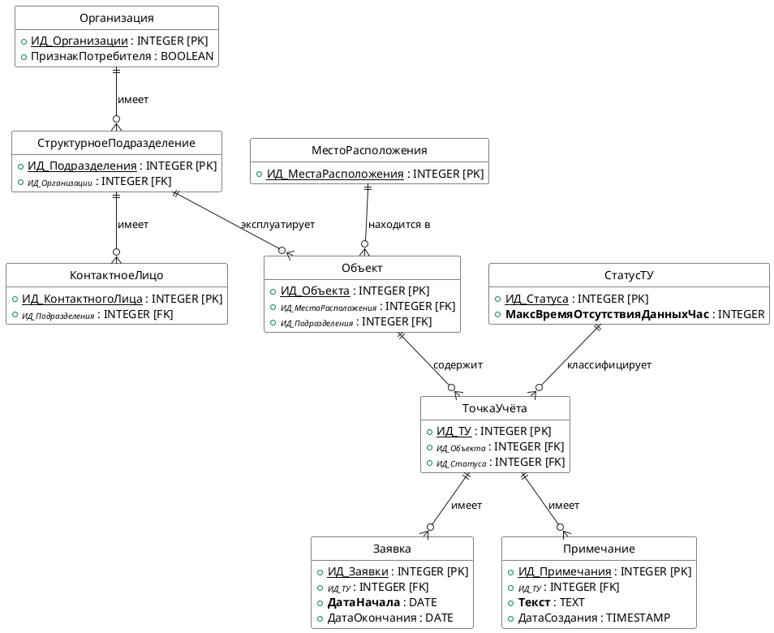

# ER-диаграмма (модель «сущность-связь»)
**Модуль справочной БД для ПО AlphaMeterQC**

**Автор:** В.Л. Солодюк
**Проект:** ПО «AlphaMeterQC» (анализ и контроль своевременности поступления, полноты и корректности данных, собранных со счётчиков электрической энергии и хранящихся в БД (Oracle) ПО АльфаЦЕНТР) / Модуль справочной БД

---

## 1. Концептуальная ER-диаграмма

## 2. Описание сущностей

| Сущность | Описание | Ключевой атрибут |
|----------|----------|-------------------|
| Организация | Юридическое лицо, которое может являться Потребителем электрической энергии | ИД_Организации |
| СтруктурноеПодразделение | Подразделение организации, в эксплуатационной ответственности которого находятся объекты | ИД_Подразделения |
| КонтактноеЛицо | Работник структурного подразделения с контактными данными | ИД_КонтактногоЛица |
| МестоРасположения | Географическое место расположения объектов | ИД_МестаРасположения |
| Объект | Объект/электроустановка, в пределах которого осуществляется учёт электроэнергии | ИД_Объекта |
| ТочкаУчёта | Точка учёта электрической энергии, идентифицируемая номером присоединения/фидера | ИД_ТУ |
| СтатусТУ | Справочник статусов ТУ с нормативным временем отсутствия данных | ИД_Статуса |
| Заявка | Заявка на выполнение работ по ТУ | ИД_Заявки |
| Примечание | Текстовое примечание по ТУ | ИД_Примечания |

## 3. Описание связей

| Связь | Тип | Сущность 1 | Сущность 2 | Правило удаления |
|-------|-----|------------|------------|------------------|
| Организация — Подразделение | 1 : M | Организация | СтруктурноеПодразделение | CASCADE (при удалении организации удаляются её подразделения) |
| Подразделение — КонтактноеЛицо | 1 : M | СтруктурноеПодразделение | КонтактноеЛицо | CASCADE (при удалении подразделения удаляются его контактные лица) |
| Подразделение — Объект | 1 : M | СтруктурноеПодразделение | Объект | RESTRICT (запрет удаления подразделения, если за ним закреплены объекты) |
| МестоРасположения — Объект | 1 : M | МестоРасположения | Объект | RESTRICT (запрет удаления места расположения, если в нём есть объекты) |
| Объект — ТочкаУчёта | 1 : M | Объект | ТочкаУчёта | CASCADE (при удалении объекта удаляются его ТУ) |
| СтатусТУ — ТочкаУчёта | 1 : M | СтатусТУ | ТочкаУчёта | RESTRICT (запрет удаления статуса, если есть ТУ с этим статусом) |
| ТочкаУчёта — Заявка | 1 : M | ТочкаУчёта | Заявка | CASCADE (при удалении ТУ удаляются её заявки) |
| ТочкаУчёта — Примечание | 1 : M | ТочкаУчёта | Примечание | CASCADE (при удалении ТУ удаляются её примечания) |