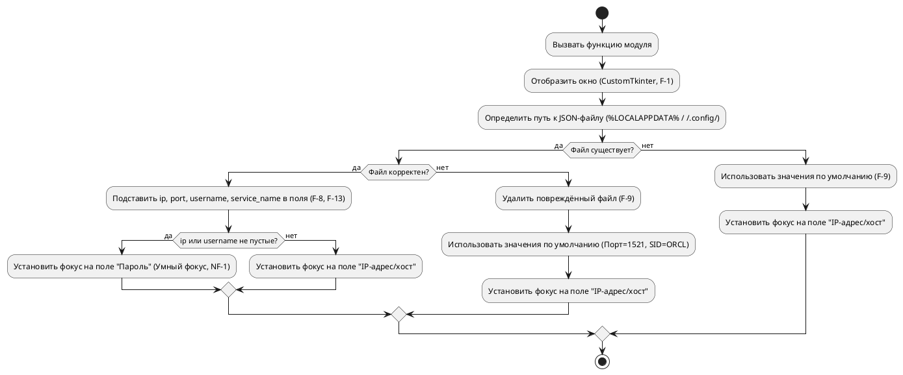
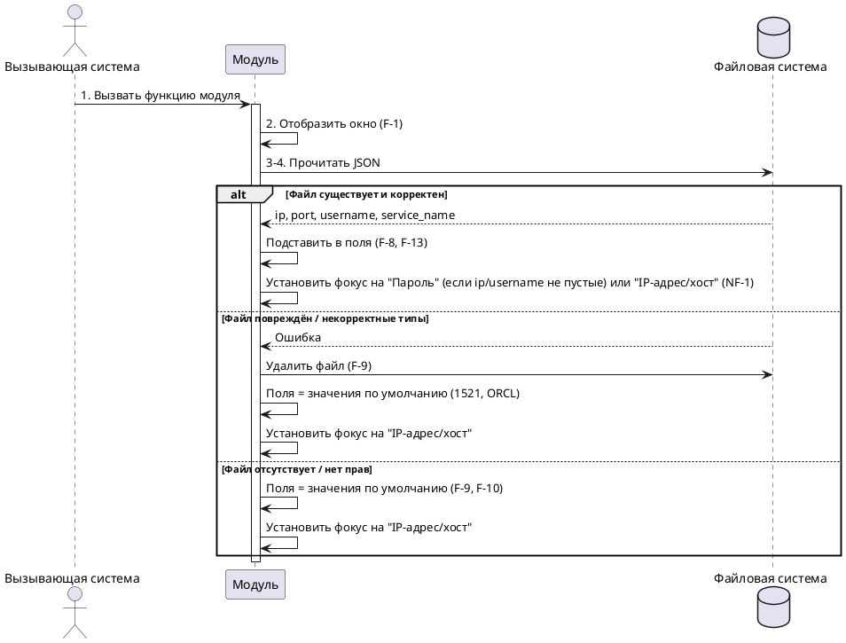

# Спецификация варианта использования «Загрузить параметры и отобразить форму ввода данных»

**Версия:** 2.0 (итоговая)  
**Дата:** 2026-06-04  
**Автор:** Солодюк В.Л.  
**Проект:** ПО «AlphaMeterQC» / Модуль ввода идентификационных данных для подключения к БД  
**Домен:** Инициализация

---

## 1. Введение

### 1.1 Цель документа
Детально описать автоматический сценарий инициализации модуля при запуске: отображение графической формы (на базе CustomTkinter) и загрузка сохранённых параметров из JSON-файла с поддержкой «умного фокуса» и значений по умолчанию.

### 1.2 Область применения
Документ предназначен для разработчиков и тестировщиков при реализации графического модуля.

### 1.3 Источники требований
- Концепция создания продукта / фичи (v3.4)
- Требования заинтересованных сторон (v2.5)
- Пользовательские истории (v2.3)
- Спецификация требований (v2.8)
- Список и диаграмма вариантов использования (v5.6)

---

## 2. Табличное описание варианта использования

| Атрибут | Значение |
|---------|----------|
| **ID** | UC.LOGIN.D0.01 |
| **Название** | Загрузить параметры и отобразить форму ввода данных |
| **Связи** | Отсутствуют |
| **Домен** | Инициализация |
| **Описание** | Вызывающая система вызывает функцию модуля (в режиме библиотеки или subprocess). Модуль отображает форму с полями «IP-адрес/хост», «Порт», «Имя пользователя», «Пароль», «Идентификатор службы (SID/Service Name)» и кнопками «Ок», «Отмена». Затем модуль автоматически загружает сохранённые параметры из JSON-файла. При отсутствии или повреждении файла поля заполняются значениями по умолчанию (Порт = 1521, Идентификатор службы = ORCL, остальные пустые). Поле пароля всегда пустое. Применяется логика «умного фокуса». |
| **Главные действующие лица** | Вызывающая система (A-2) |
| **Вовлеченные действующие лица** | Отсутствуют |
| **Предусловия** | 1. Модуль подключён к вызывающей системе как пакет (библиотека) или запущен как отдельный процесс (subprocess). 2. Графическое окно готово к отображению. |
| **Постусловия** | 1. Графическое окно отображено на экране (F-1). 2. Поля IP-адрес/хост, порт, имя пользователя, идентификатор службы заполнены значениями из файла (или значениями по умолчанию, если файла нет). 3. Поле пароля всегда пустое. 4. Кнопка «Ок» неактивна (F-4). 5. Фокус ввода установлен на поле «Пароль» (если поле `ip` или `username` не пустое) или на поле «IP-адрес/хост» (при первом запуске/отсутствии данных). |

---

## 3. Основной поток

| Шаг | Актор | Действие и логика системы |
|-----|-------|---------------------------|
| 1 | Вызывающая система | Вызывает функцию (API) модуля для отображения окна ввода. |
| 2 | Модуль | Отображает графическое окно с 5 полями и кнопками на базе CustomTkinter (F-1). |
| 3 | Модуль | Определяет путь к файлу: `%LOCALAPPDATA%\alphameterqc\connection.json` (Windows) или `~/.config/alphameterqc/connection.json` (Linux). |
| 4 | Модуль | Пытается прочитать файл. |
| 5 | Модуль | **Если файл существует и содержит корректный JSON (F-13):** — Извлекает значения полей `ip`, `port`, `username`, `service_name`. — Если поле отсутствует в JSON — использует значение по умолчанию. — Подставляет полученные значения в соответствующие поля формы (F-8).  **Если файл отсутствует (F-9):** — Новый файл не создаётся. — Поля получают значения по умолчанию.  **Если файл повреждён или содержит некорректный JSON/типы данных (F-9):** — Повреждённый файл удаляется. — Поля получают значения по умолчанию.  **Если отсутствуют права на чтение (F-10):** — Продолжает работу без загрузки параметров. — Поля получают значения по умолчанию. — Не выводит сообщений об ошибке. |
| 6 | Модуль | **Умный фокус (NF-1):** — Если поле `ip` или `username` не пустое (заполнено из файла или передано как default), фокус ввода устанавливается на поле «Пароль» (для ускорения ввода). — Иначе (первый запуск, все поля пусты) — фокус устанавливается на поле «IP-адрес/хост». |

---

## 4. Значения по умолчанию

| Поле | Значение по умолчанию |
|------|-----------------------|
| IP-адрес / Хост | Пустая строка `""` |
| Порт | `1521` |
| Имя пользователя | Пустая строка `""` |
| Пароль | Пустая строка `""` (всегда) |
| Идентификатор службы (SID/Service Name) | `"ORCL"` |

---

## 5. Обработка ошибок

| Ситуация | Реакция модуля |
|----------|----------------|
| Файл отсутствует | Не создавать новый. Поля = значения по умолчанию. Без сообщений. |
| Файл повреждён / некорректный тип данных | Удалить файл. Поля = значения по умолчанию. Без сообщений. |
| Нет прав на чтение | Продолжить работу без загрузки. Поля = значения по умолчанию. Без уведомлений. |
| Необработанное исключение в UI | Не допускать зависаний (NF-2b). Окно остаётся отзывчивым. |

---

## 6. Диаграмма деятельности (PlantUML)

---

## 7. Диаграмма последовательности (PlantUML)

---

## 8. Сводка покрытия требований (F)

| F-ID | Описание | Покрытие |
|------|----------|----------|
| F-1 | Отображение окна с 5 полями и кнопками (CustomTkinter) | Шаг 2 |
| F-8 | Подстановка параметров из файла при запуске | Шаг 5 (ветка «файл существует и корректен») |
| F-9 | Отсутствие файла — ничего не создавать; повреждение — удалить; подстановка значений по умолчанию | Шаг 5 (ветки отсутствия и повреждения) |
| F-10 | Отсутствие прав на чтение | Шаг 5 (ветка «нет прав») |
| F-13 | JSON-формат, значения по умолчанию (1521, ORCL), `%LOCALAPPDATA%` | Шаг 3, Шаг 5, таблица значений |

---

## 9. Сводка покрытия нефункциональных требований (NF)

| NF-ID | Описание требования | Покрытие |
|-------|---------------------|----------|
| NF-1 | Снижение времени ввода (умный фокус на поле «Пароль») | Шаг 6 |
| NF-2b | Нет зависаний интерфейса > 0,5 с | Обработка ошибок |
| NF-2c | Нет необработанных исключений при проблемах с ФС | Обработка ошибок |
| NF-5 | Интеграция без изменения кода (поддержка режима subprocess) | Предусловие №1 |
| NF-7 | Отсутствие скрытых зависимостей (CustomTkinter) | Шаг 2 |

---

## 10. Связи с другими вариантами использования

| UC-ID | Название | Тип связи | Описание |
|-------|----------|-----------|----------|
| UC.LOGIN.D1.01 | Ввести/исправить идентификационные данные | Предшествует | Выполняется пользователем после инициализации |
| UC.LOGIN.D3.01 | Предоставить контракт взаимодействия | Предшествует | Описывает API вызова модуля |