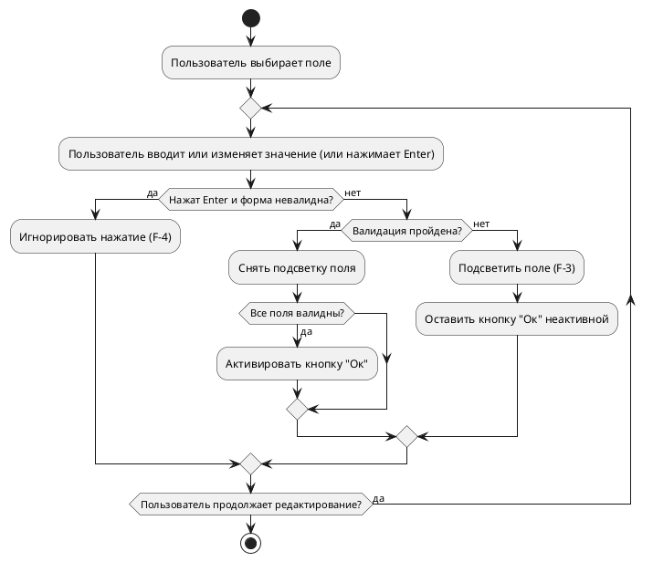
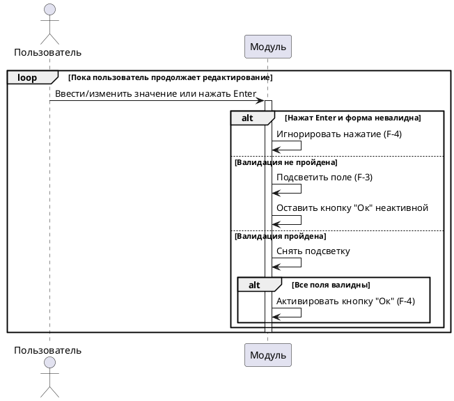

# Спецификация варианта использования «Ввести/исправить идентификационные данные»

**Версия:** 6.8 (итоговая)  
**Дата:** 2026-06-04  
**Автор:** Солодюк В.Л.  
**Проект:** ПО «AlphaMeterQC» / Модуль ввода идентификационных данных для подключения к БД  
**Домен:** Управление вводом и валидацией

---

## 1. Введение

### 1.1 Цель документа
Детально описать сценарий ввода и исправления пользователем идентификационных данных (IP-адрес/хост, порт, имя пользователя, пароль, идентификатор службы) в графическом модуле, включая автоматическую валидацию в реальном времени (со строгими правилами для DNS-имён), визуальную индикацию ошибок, управление активностью кнопки «Ок», маскировку пароля и обработку клавиши Enter.

### 1.2 Область применения
Документ предназначен для разработчиков и тестировщиков при реализации графического модуля.

### 1.3 Источники требований
- Концепция создания продукта / фичи (v3.4)
- Требования заинтересованных сторон (v2.5)
- Пользовательские истории (v2.3)
- Спецификация требований (v2.8)
- Список и диаграмма вариантов использования (v5.6)

---

## 2. Табличное описание варианта использования

| Атрибут | Значение |
|---------|----------|
| **ID** | UC.LOGIN.D1.01 |
| **Название** | Ввести/исправить идентификационные данные |
| **Связи** | Отсутствуют |
| **Домен** | Управление вводом и валидацией |
| **Описание** | Пользователь заполняет или изменяет значения в полях: IP-адрес/хост (IPv4 или строгое DNS-имя), порт, имя пользователя, пароль, идентификатор службы (SID/Service Name). Модуль автоматически проверяет корректность, подсвечивает ошибки, управляет кнопкой «Ок», маскирует пароль. Если форма невалидна, нажатие клавиши Enter игнорируется. |
| **Главные действующие лица** | Пользователь (A-1) |
| **Вовлеченные действующие лица** | Отсутствуют |
| **Предусловия** | 1. Модуль запущен вызывающей системой. 2. Графическое окно отображено на экране на базе CustomTkinter (F-1). 3. Выполнена загрузка параметров (UC.LOGIN.D0.01). 4. Поля инициализированы, кнопка «Ок» неактивна (F-4). |
| **Постусловия (успех)** | 1. Все поля корректны согласно строгим правилам валидации (раздел 1.6 Спецификации требований). 2. Кнопка «Ок» активна. 3. Пароль замаскирован (F-11). |
| **Постусловия (отмена)** | Состояние не изменено, модуль ожидает действий. |

---

## 3. Основной поток

**Примечания:**
- **Навигация:** Перемещение фокуса между полями — стандартное поведение GUI (Tab Order: IP → Порт → Имя → Пароль → SID → Ок → Отмена).
- **Маскировка пароля:** При вводе в поле «Пароль» символы отображаются как «•» (F-11).
- **Кнопка «Ок»:** Изначально неактивна (F-4). Активируется только когда все обязательные поля валидны.
- **Валидация:** Выполняется автоматически при каждом изменении содержимого поля (F-2) по строгим правилам раздела 1.6 Спецификации требований. Пустое значение = ошибка (кроме идентификатора службы — опционально).
- **Обработка клавиши Enter:** Если форма невалидна (кнопка «Ок» неактивна), нажатие клавиши Enter игнорируется, окно не закрывается.
- **Безопасность (NF-3b):** Пароль НЕ ДОЛЖЕН передаваться в логи, консоль, файлы или иные внешние источники.

| Шаг | Актор | Действие и логика системы |
|-----|-------|---------------------------|
| 1 | Пользователь | Выбирает поле и вводит или изменяет значение (или нажимает Enter). |
| 1.1 | Модуль | **Если нажата клавиша Enter и форма невалидна:** — Игнорирует нажатие, окно не закрывается (F-4).  **Если валидация не пройдена:** — Подсвечивает поле (F-3). — Кнопка «Ок» остаётся неактивной.  **Если валидация пройдена:** — Снимает подсветку. — Если все поля валидны — активирует кнопку «Ок» (F-4). |
| 1.2 | Модуль | Повторять шаги 1–1.1, пока пользователь продолжает редактирование. |
| 2 | Модуль | (Конец потока. Далее — UC.LOGIN.D2.01 «Подтвердить ввод», который сохраняет IP, порт, имя пользователя и идентификатор службы в JSON-файл (F-7, F-13).) |

---

## 4. Диаграмма деятельности (PlantUML)

---

## 5. Диаграмма последовательности (PlantUML)

---

## 6. Сводка покрытия требований (F)

| F-ID | Описание | Покрытие |
|------|----------|----------|
| F-1 | Отображение окна с 5 полями и кнопками (CustomTkinter) | Предусловие №2 |
| F-2 | Валидация в реальном времени (IPv4 + строгий DNS) | Шаг 1.1 |
| F-3 | Подсветка некорректных полей | Шаг 1.1 |
| F-4 | Управление активностью кнопки «Ок» (игнорирование Enter при невалидной форме) | Предусловие №4, шаг 1.1, Примечания |
| F-11 | Маскировка пароля | Примечание к ОП |

---

## 7. Сводка покрытия нефункциональных требований (NF)

| NF-ID | Описание требования | Покрытие |
|-------|---------------------|----------|
| NF-2b | Нет зависаний интерфейса > 0,5 с | Обработка ошибок |
| NF-2c | Нет необработанных исключений | Обработка ошибок |
| NF-3b | Пароль не передаётся в логи, консоль, файлы | Примечание к ОП |

---

## 8. Связи с другими вариантами использования

| UC-ID | Название | Тип связи | Описание |
|-------|----------|-----------|----------|
| UC.LOGIN.D0.01 | Загрузить параметры и отобразить форму ввода данных | Предшествует | Выполняется перед началом ввода |
| UC.LOGIN.D2.01 | Подтвердить ввод | Предшествует | Выполняется после успешного ввода |
| UC.LOGIN.D2.02 | Отменить ввод | Альтернатива | Может быть выполнена вместо подтверждения на любом этапе |