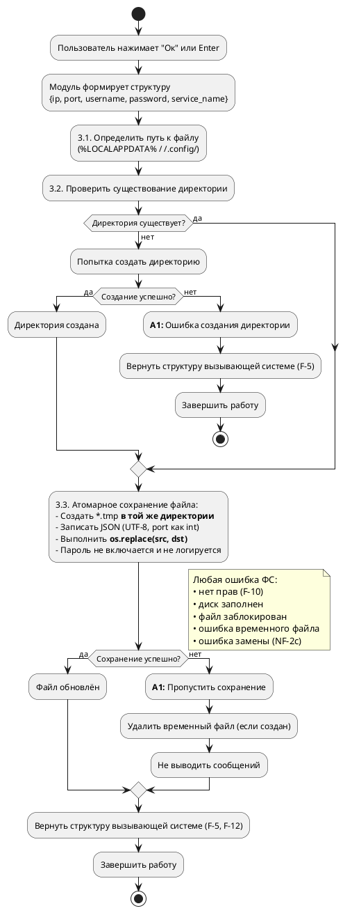
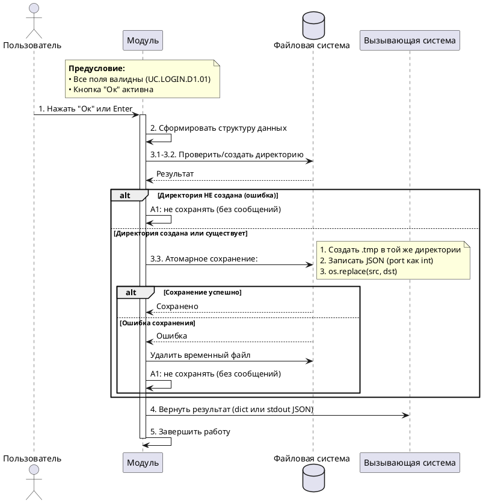

# Спецификация варианта использования «Подтвердить ввод»

**Версия:** 4.1 (итоговая)  
**Дата:** 2026-06-04  
**Автор:** Солодюк В.Л.  
**Проект:** ПО «AlphaMeterQC» / Модуль ввода идентификационных данных для подключения к БД  
**Домен:** Завершение сеанса

---

## 1. Введение

### 1.1 Цель документа
Детально описать сценарий подтверждения пользователем введённых идентификационных данных, включая возврат структуры данных вызывающей системе, автоматическое атомарное сохранение (кроме пароля) в JSON-файл, а также корректную обработку ошибок файловой системы.

### 1.2 Область применения
Документ предназначен для разработчиков и тестировщиков при реализации графического модуля.

### 1.3 Источники требований
- Концепция создания продукта / фичи (v3.4)
- Требования заинтересованных сторон (v2.5)
- Пользовательские истории (v2.3)
- Спецификация требований (v2.8)
- Список и диаграмма вариантов использования (v5.6)

---

## 2. Табличное описание варианта использования

| Атрибут | Значение |
|---------|----------|
| **ID** | UC.LOGIN.D2.01 |
| **Название** | Подтвердить ввод |
| **Связи** | Отсутствуют |
| **Домен** | Завершение сеанса и возврат результата |
| **Описание** | Пользователь нажимает кнопку «Ок» или клавишу Enter. Модуль возвращает вызывающей системе структуру с данными, а также автоматически сохраняет IP-адрес/хост, порт, имя пользователя и идентификатор службы в JSON-файл (атомарная запись через `os.replace`). Пароль не сохраняется. При работе в режиме subprocess результат передаётся через stdout. |
| **Главные действующие лица** | Пользователь (A-1) |
| **Вовлеченные действующие лица** | Вызывающая система (A-2) |
| **Предусловия** | 1. Модуль находится в состоянии, когда все поля валидны (UC.LOGIN.D1.01 завершён успешно). 2. Кнопка «Ок» активна (F-4). 3. Поля содержат: IP-адрес/хост, порт, имя пользователя, пароль, идентификатор службы. |
| **Постусловия (успех)** | 1. Вызывающая система получила структуру `{ip, port, username, password, service_name}` (или JSON через stdout в режиме subprocess) (F-5, F-12). 2. Параметры (кроме пароля) сохранены в JSON-файл с использованием атомарной записи (F-7, F-13). 3. Пароль не сохранён на диск и не передан в логи (NF-3a, NF-3b). 4. Модуль завершил работу. |
| **Постусловия (ошибка ФС)** | Данные возвращены вызывающей системе, но файл не обновлён. Ошибка обработана молча, без прерывания работы (F-10, NF-2c). |

---

## 3. Основной поток

| Шаг | Актор | Действие и логика системы |
|-----|-------|---------------------------|
| 1 | Пользователь | Нажимает кнопку «Ок» или клавишу Enter. |
| 2 | Модуль | Формирует структуру данных `{ip, port, username, password, service_name}` из текущих значений полей. |
| 3.1 | Модуль | Определяет путь к файлу: `%LOCALAPPDATA%\alphameterqc\connection.json` (Windows) или `~/.config/alphameterqc/connection.json` (Linux). |
| 3.2 | Модуль | Проверка и создание директории: — **Если** директория существует — переходит к шагу 3.3. — **Если** директория не существует — пытается создать её рекурсивно. &nbsp;&nbsp;&nbsp;&nbsp;• **Если** создание успешно — переходит к шагу 3.3. &nbsp;&nbsp;&nbsp;&nbsp;• **Если** создание не удалось (нет прав, диск заполнен) — переходит к альтернативному потоку A1. |
| 3.3 | Модуль | **Атомарное сохранение файла:** — Создаёт временный файл (`.tmp`) **строго в той же директории**, что и целевой файл. — Записывает в него данные в формате JSON (UTF-8). Поле `port` сериализуется как целое число (`int`). — Выполняет атомарную замену целевого файла временным с использованием стандартной функции Python `os.replace(src, dst)`. Эта функция гарантирует атомарную замену на POSIX-системах и корректно выполняет замену существующего файла на Windows, не требуя использования сторонних библиотек (`ctypes`). — **Пароль не включается в файл и не логируется** (NF-3a, NF-3b). — **Если** операция замены не удалась — удаляет временный файл и переходит к альтернативному потоку A1. |
| 4 | Модуль | Возвращает результат вызывающей системе: — В режиме библиотеки: возвращает структуру `dict`. — В режиме subprocess: выводит JSON `{"status": "success", "data": {...}}` в `stdout` и завершает работу с кодом 0. |
| 5 | Модуль | Завершает работу (передаёт управление вызывающей системе или закрывает процесс). |

---

## 4. Альтернативный поток A1: Ошибка сохранения файла

Применяется при любой ошибке файловой системы при попытке создания директории или сохранения JSON-файла: отсутствие прав на запись (F-10), диск заполнен, файл заблокирован, сетевой диск недоступен, ошибка создания временного файла, ошибка замены и т.п. (NF-2c).

| Шаг | Актор | Действие и логика системы |
|-----|-------|---------------------------|
| 3a.1 | Модуль | Возникает ошибка файловой системы. |
| 3a.2 | Модуль | **Не сохраняет изменения.** **Не выводит сообщений об ошибке** пользователю (F-10, NF-2c). Обрабатывает исключение молча (логирует только в режиме `debug`, без пароля). **Если** временный файл был создан — удаляет его. |
| 3a.3 | Модуль | Продолжает выполнение основного потока с шага 4 (возврат данных вызывающей системе, так как данные валидны и готовы к использованию, несмотря на сбой сохранения настроек). |

---

## 5. Диаграмма деятельности (PlantUML)

---

## 6. Диаграмма последовательности (PlantUML)

---

## 7. Сводка покрытия требований (F)

| F-ID | Описание | Покрытие |
|------|----------|----------|
| F-5 | При нажатии «Ок» возвращать структуру `{ip, port, username, password, service_name}` | Шаг 4, диаграммы |
| F-7 | При успешном завершении сохранять параметры (кроме пароля). Атомарная запись через `.tmp` в той же директории и `os.replace` | Шаг 3.3, A1 |
| F-12 | Предоставление контракта взаимодействия (включая режим subprocess) | Шаг 4 |
| F-13 | JSON-формат, структура, значения по умолчанию, `%LOCALAPPDATA%`, `port` как `int` | Шаг 3.1, 3.3 |

---

## 8. Сводка покрытия нефункциональных требований (NF)

| NF-ID | Описание требования | Покрытие |
|-------|---------------------|----------|
| NF-2b | Нет зависаний интерфейса > 0,5 с | Обработка ошибок |
| NF-2c | Нет необработанных исключений при проблемах с ФС | A1, шаг 3a.2 |
| NF-3a | Пароль не сохраняется на диск | Шаг 3.3 |
| NF-3b | Пароль не передаётся в логи, консоль, файлы | Шаг 3.3 |
| NF-5 | Интеграция без изменения кода (поддержка режима subprocess) | Шаг 4 |

---

## 9. Связи с другими вариантами использования

| UC-ID | Название | Тип связи | Описание |
|-------|----------|-----------|----------|
| UC.LOGIN.D1.01 | Ввести/исправить идентификационные данные | Предшествует | Выполняется перед подтверждением |
| UC.LOGIN.D3.01 | Предоставить контракт взаимодействия | Документирует | Описывает API возврата результата, детализированный в этом UC |