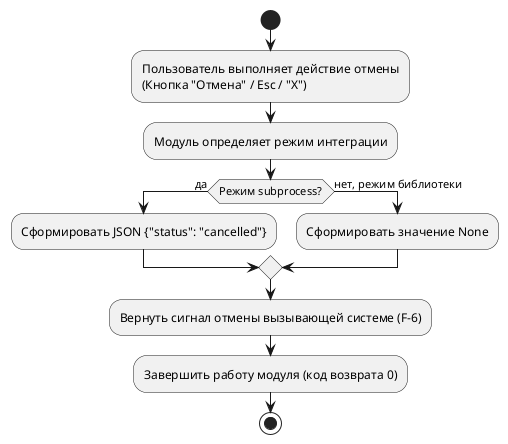
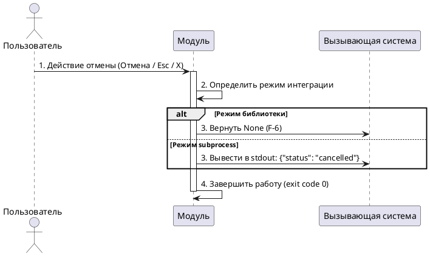

# Спецификация варианта использования «Отменить ввод»

**Версия:** 1.3 (итоговая)  
**Дата:** 2026-06-04  
**Автор:** Солодюк В.Л.  
**Проект:** ПО «AlphaMeterQC» / Модуль ввода идентификационных данных для подключения к БД  
**Домен:** Завершение сеанса

---

## 1. Введение

### 1.1 Цель документа
Детально описать сценарий отмены пользователем ввода идентификационных данных, включая формирование и возврат сигнала отмены вызывающей системе в зависимости от режима интеграции, а также корректную обработку критических сбоев.

### 1.2 Область применения
Документ предназначен для разработчиков и тестировщиков при реализации графического модуля и его интеграции с вызывающей системой.

### 1.3 Источники требований
- Концепция создания продукта / фичи (v3.4)
- Требования заинтересованных сторон (v2.5)
- Пользовательские истории (v2.3)
- Спецификация требований (v2.8)
- Список и диаграмма вариантов использования (v5.6)

---

## 2. Табличное описание варианта использования

| Атрибут | Значение |
|---------|----------|
| **ID** | UC.LOGIN.D2.02 |
| **Название** | Отменить ввод |
| **Связи** | Альтернатива к UC.LOGIN.D2.01 |
| **Домен** | Завершение сеанса и возврат результата |
| **Описание** | Пользователь нажимает кнопку «Отмена», закрывает окно через системную кнопку «X» или нажимает клавишу `Esc`. Модуль немедленно формирует сигнал отмены, возвращает его вызывающей системе и завершает работу, **не сохраняя никаких данных**. |
| **Главные действующие лица** | Пользователь (A-1) |
| **Вовлеченные действующие лица** | Вызывающая система (A-2) |
| **Предусловия** | 1. Модуль запущен и отображает графическое окно. 2. Окно находится в активном состоянии (любое состояние заполнения полей). |
| **Постусловия (успех)** | 1. Вызывающая система получила сигнал отмены (`None` в режиме библиотеки или `{"status": "cancelled"}` в режиме subprocess) (F-6). 2. Модуль корректно завершил работу, данные не были сохранены. |

---

## 3. Основной поток

| Шаг | Актор | Действие и логика системы |
|-----|-------|---------------------------|
| 1 | Пользователь | Выполняет одно из действий отмены: — Нажимает кнопку «Отмена». — Нажимает клавишу `Esc`. — Закрывает окно через системную кнопку «X». |
| 2 | Модуль | Определяет текущий режим интеграции и формирует ответ: — **Режим библиотеки:** формирует значение `None`. — **Режим subprocess:** формирует JSON-строку `{"status": "cancelled"}` для вывода в `stdout`. |
| 3 | Модуль | Возвращает сформированный сигнал отмены вызывающей системе (F-6). |
| 4 | Модуль | Завершает работу (закрывает окно и/или завершает процесс с кодом возврата `0`). |

---

## 4. Обработка ошибок

| Ситуация | Реакция модуля |
|----------|----------------|
| **Необработанное исключение в UI при попытке закрытия** | Не допускать зависаний (NF-2b). Модуль должен принудительно завершить процесс с кодом возврата, отличным от `0` (например, `1`).  **Важно для subprocess:** перед завершением модуль обязан вывести в `stdout` или `stderr` JSON: `{"status": "error", "message": "Критическая ошибка закрытия"}`. Это гарантирует, что вызывающая система, ожидающая JSON, не зависнет в бесконечном ожидании и сможет зафиксировать аварийное завершение. |

---

## 5. Диаграмма деятельности (PlantUML)

---

## 6. Диаграмма последовательности (PlantUML)

---

## 7. Сводка покрытия требований (F)

| F-ID | Описание | Покрытие |
|------|----------|----------|
| F-6 | При нажатии «Отмена», закрытии окна через «X» или Esc возвращать сигнал отмены | Шаг 2, Шаг 3, диаграммы |
| F-12 | Предоставление контракта взаимодействия (включая режим subprocess и обработку ошибок) | Шаг 2, Раздел 4 (Обработка ошибок) |

---

## 8. Сводка покрытия нефункциональных требований (NF)

| NF-ID | Описание требования | Покрытие |
|-------|---------------------|----------|
| NF-2b | Нет зависаний интерфейса > 0,5 с | Раздел 4 (Обработка ошибок) |
| NF-5 | Интеграция без изменения кода (стандартный сигнал отмены) | Шаг 3 |

---

## 9. Связи с другими вариантами использования

| UC-ID | Название | Тип связи | Описание |
|-------|----------|-----------|----------|
| UC.LOGIN.D1.01 | Ввести/исправить идентификационные данные | Альтернатива | Пользователь может отменить ввод на любом этапе заполнения полей |
| UC.LOGIN.D3.01 | Предоставить контракт взаимодействия | Документирует | Результат «отмена» соответствует сценарию, описанному в контракте API |

---

## 10. Изменения по сравнению с версией 1.2

| № | Изменение | Обоснование |
|---|-----------|-------------|
| 1 | **Источники требований:** Обновлены версии документов (Концепция v3.4, ТЗС v2.5, US v2.3, SRS v2.8, Список UC v5.6) | Актуализация базы знаний после сквозного анализа |
| 2 | **Обработка ошибок:** Добавлено явное правило вывода `{"status": "error", ...}` и кода возврата `!= 0` при критическом сбое в режиме subprocess | Синхронизация с ТЗ для предотвращения зависания вызывающей системы при аварийном завершении модуля |
| 3 | **Диаграммы:** Обновлены PlantUML-диаграммы для отражения логики обработки критической ошибки | Синхронизация визуальной и текстовой спецификации |