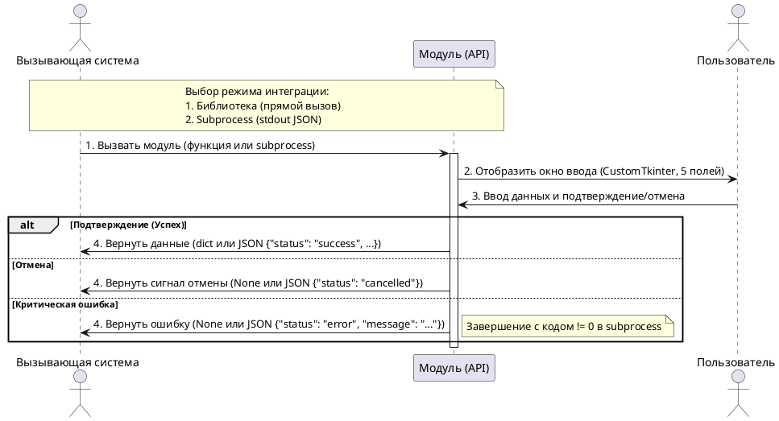
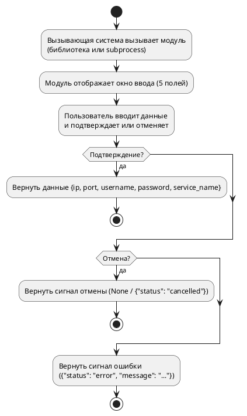

# Спецификация варианта использования «Предоставить контракт взаимодействия»

**Версия:** 1.7 (итоговая)  
**Дата:** 2026-06-04  
**Автор:** Солодюк В.Л.  
**Проект:** ПО «AlphaMeterQC» / Модуль ввода идентификационных данных для подключения к БД  
**Домен:** Интеграция

---

## 1. Введение

### 1.1 Цель документа
Описать контракт взаимодействия между модулем и вызывающей системой на уровне бизнес-правил и технических обязательств. Документ фиксирует поддержку двух режимов интеграции: режима библиотеки (по умолчанию) и режима отдельного процесса (subprocess) для предотвращения конфликтов графических циклов (Event Loop), а также форматы возврата данных, отмены и критических ошибок.

### 1.2 Область применения
Документ предназначен для архитекторов, разработчиков и тестировщиков при проектировании и проверке интеграции модуля с вызывающей системой (ПО «AlphaMeterQC»).

### 1.3 Источники требований
- Концепция создания продукта / фичи (v3.4)
- Требования заинтересованных сторон (v2.5)
- Пользовательские истории (v2.3)
- Спецификация требований (v2.8)
- Список и диаграмма вариантов использования (v5.6)

---

## 2. Табличное описание варианта использования

| Атрибут | Значение |
|---------|----------|
| **ID** | UC.LOGIN.D3.01 |
| **Название** | Предоставить контракт взаимодействия |
| **Связи** | Отсутствуют (документирующий UC) |
| **Домен** | Интеграция |
| **Описание** | Модуль предоставляет вызывающей системе публичный API. Поддерживаются два режима интеграции: режим библиотеки (импорт и прямой вызов функции) и режим отдельного процесса (subprocess с обменом через stdout/JSON) для предотвращения конфликтов графических циклов (Event Loop). |
| **Главные действующие лица** | Вызывающая система (A-2) |
| **Вовлеченные действующие лица** | Отсутствуют |
| **Предусловия** | 1. Модуль разработан и поставляется как библиотека/пакет или как самостоятельный исполняемый файл (.exe). 2. Вызывающая система готова к вызову модуля выбранным способом. |
| **Постусловия (успех)** | 1. Вызывающая система успешно вызвала модуль. 2. Вызывающая система получила и корректно обработала результат (данные, сигнал отмены или ошибку). 3. Модуль интегрирован без внесения изменений в существующий код вызывающей системы (NF-5). |

---

## 3. Основной поток

| Шаг | Актор | Действие и логика системы |
|-----|-------|---------------------------|
| 1 | Вызывающая система | Инициирует вызов модуля: — **Режим библиотеки:** импортирует пакет и вызывает функцию `show_dialog()`. — **Режим subprocess:** запускает исполняемый файл через `subprocess.run(..., capture_output=True, text=True)`. |
| 2 | Модуль | Отображает графическое окно для ввода данных (5 полей, CustomTkinter). |
| 3 | Пользователь | Вводит данные и подтверждает (Ок/Enter) или отменяет (Отмена/Esc/X) ввод. |
| 4 | Модуль | Возвращает вызывающей системе результат в зависимости от режима и исхода: — **Успех:** возвращает `dict` (библиотека) или JSON `{"status": "success", "data": {...}}` (subprocess). — **Отмена:** возвращает `None` (библиотека) или JSON `{"status": "cancelled"}` (subprocess). — **Ошибка:** возвращает `None` с логом в `stderr` (библиотека) или JSON `{"status": "error", "message": "..."}` с кодом возврата `!= 0` (subprocess). |

---

## 4. Контрактные обязательства

### Обязательства модуля
| Обязательство | Описание |
|---------------|----------|
| **API вызов** | Модуль предоставляет стабильную точку входа: функцию `show_dialog()` или исполняемый файл с предсказуемым поведением. |
| **Результат** | Модуль всегда возвращает либо данные подключения (5 полей), либо явный сигнал отмены/ошибки. Внутренние ошибки файловой системы не прерывают возврат данных (данные возвращаются, но не сохраняются). |
| **Сохранение** | Модуль автоматически сохраняет IP, порт, имя пользователя и идентификатор службы при успешном подтверждении (атомарная запись). |
| **Безопасность** | Модуль гарантированно не сохраняет пароль на диск (NF-3a) и не передаёт его в логи, консоль или stdout (NF-3b). |
| **Стабильность API** | Сигнатура функции и формат JSON-ответа остаются стабильными между минорными версиями модуля. |

### Обязательства вызывающей системы
| Обязательство | Описание |
|---------------|----------|
| **Подключение** | Вызывающая система подключает модуль как пакет (библиотеку) или запускает как subprocess в зависимости от своего GUI-фреймворка. |
| **Обработка результата** | Вызывающая система корректно обрабатывает все возможные результаты: парсит словарь/JSON при успехе, обрабатывает `None` / `{"status": "cancelled"}` при отмене, и `{"status": "error"}` при сбое. |
| **Среда исполнения** | Вызывающая система обеспечивает целевую среду (Windows/Linux, совместимость с PyInstaller, наличие прав на чтение/запись в `%LOCALAPPDATA%` или `~/.config/`). |

---

## 5. Формат возвращаемого результата

| Результат | Режим библиотеки (Python) | Режим subprocess (stdout JSON) | Описание |
|-----------|---------------------------|--------------------------------|----------|
| **Успех (подтверждение)** | `{"ip": str, "port": int, "username": str, "password": str, "service_name": str}` | `{"status": "success", "data": {"ip": "...", "port": 1521, "username": "...", "password": "...", "service_name": "..."}}` | Структура с данными подключения (5 полей). |
| **Отмена** | `None` | `{"status": "cancelled"}` | Пользователь отменил ввод (кнопка, Esc, закрытие окна). |
| **Ошибка (критическая)** | `None` (с логированием в `stderr`, если `debug=True`) | `{"status": "error", "message": "..."}` (код возврата `!= 0`) | Внутренняя критическая ошибка модуля (например, сбой инициализации GUI или закрытия). |

---

## 6. Диаграмма последовательности (PlantUML)

---

## 7. Диаграмма деятельности (PlantUML)

---

## 8. Сводка покрытия требований (F)

| F-ID | Описание требования | Покрытие в UC |
|------|---------------------|---------------|
| F-12 | Предоставлять задокументированный контракт взаимодействия (включая режим subprocess и обработку ошибок) | Весь UC, Основной поток (Шаг 4), Формат результата |

---

## 9. Сводка покрытия нефункциональных требований (NF)

| NF-ID | Описание требования | Покрытие в UC |
|-------|---------------------|---------------|
| NF-5 | Интеграция без изменения кода или перекомпиляции основного ПО (поддержка subprocess) | Контрактные обязательства, Основной поток |
| NF-7 | Отсутствие скрытых зависимостей (CustomTkinter упаковывается вместе с приложением) | Контрактные обязательства модуля |
| NF-3b | Пароль не передаётся в логи, консоль, файлы | Контрактные обязательства модуля (Безопасность) |

---

## 10. Связи с другими вариантами использования

| UC-ID | Название | Тип связи | Описание |
|-------|----------|-----------|----------|
| UC.LOGIN.D2.01 | Подтвердить ввод | Документирует | Результат «успех» соответствует сценарию подтверждения, детализированному в UC.LOGIN.D2.01 |
| UC.LOGIN.D2.02 | Отменить ввод | Документирует | Результат «отмена» и «ошибка» соответствуют сценариям, детализированным в UC.LOGIN.D2.02 |

*Примечание: UC.LOGIN.D3.01 является документирующим и не содержит исполнительных связей `<<include>>`. Он описывает API, результаты которого соответствуют сценариям, детализированным в UC.LOGIN.D2.01 и UC.LOGIN.D2.02.*

---

## 11. Изменения по сравнению с версией 1.6

| № | Изменение | Обоснование |
|---|-----------|-------------|
| 1 | **Источники требований:** Обновлены версии документов (Концепция v3.4, ТЗС v2.5, US v2.3, SRS v2.8, Список UC v5.6) | Актуализация базы знаний после сквозного анализа |
| 2 | **Формат возвращаемого результата:** Добавлена строка «Ошибка (критическая)» с описанием поведения для режима библиотеки (`None` + `stderr`) и subprocess (`{"status": "error", ...}` + код `!= 0`) | Синхронизация с UC.LOGIN.D2.02 и ТЗ для предотвращения зависания вызывающей системы при критическом сбое модуля |
| 3 | **Диаграммы:** Обновлены PlantUML-диаграммы для отражения ветки обработки критической ошибки | Синхронизация визуальной и текстовой спецификации |