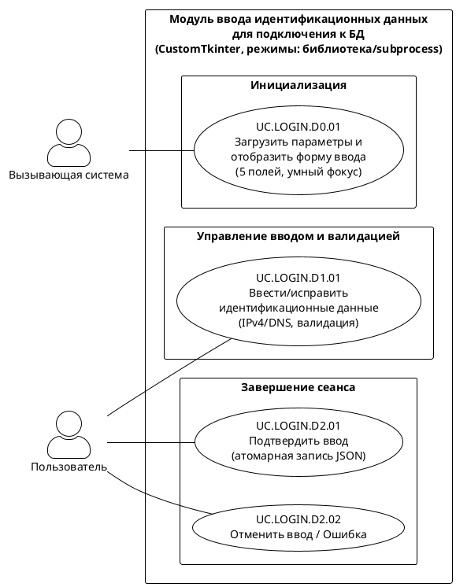

# Список и диаграмма вариантов использования

**Версия:** 5.6 (итоговая)  
**Дата:** 2026-06-04  
**Автор:** Солодюк В.Л.  
**Проект:** ПО «AlphaMeterQC» / Модуль ввода идентификационных данных для подключения к БД

---

## 1. Введение

### 1.1 Цель документа
Формально описать границы системы, действующих лиц и варианты использования модуля ввода идентификационных данных для подключения к БД Oracle на основе утверждённой спецификации требований (SRS).

### 1.2 Область применения
Модуль ввода идентификационных данных (графический компонент) для ввода, валидации и безопасной передачи параметров подключения к БД Oracle, а также локального сохранения (кроме пароля) части параметров.

### 1.3 Источники требований
- Концепция создания продукта / фичи (v3.4)
- Требования заинтересованных сторон (v2.5)
- Пользовательские истории (v2.3)
- Спецификация требований (v2.8)

---

## 2. Определение контекста и границ системы

**Границы системы (внутри):**
- отображение графического окна с 5 полями ввода (IP-адрес/хост, порт, имя пользователя, пароль, идентификатор службы);
- валидация полей в реальном времени (включая строгую поддержку DNS-имён для IP-адрес/хост);
- управление активностью кнопки «Ок» (игнорирование Enter при невалидной форме);
- маскирование пароля;
- автоматическое сохранение параметров (кроме пароля) в JSON-файл при успешном подтверждении (атомарная запись через `os.replace`);
- автоматическая загрузка сохранённых параметров при запуске (с упрощённым умным фокусом);
- автоматическая обработка ошибок файловой системы (отсутствие файла, повреждение, отсутствие прав);
- возврат результата (данные, отмена или ошибка) вызывающей системе;
- поддержка двух режимов интеграции: библиотека (по умолчанию) и subprocess (для исключения конфликтов Event Loop).

**Вне границы системы:**
- вызывающая система — запускает модуль и получает результат;
- пользователь — вводит данные и управляет диалогом.

---

## 3. Действующие лица

| ID | Действующее лицо | Описание |
|----|------------------|----------|
| A-1 | Пользователь | Оператор или администратор, который вводит идентификационные данные для подключения к БД Oracle |
| A-2 | Вызывающая система | Внешнее ПО, которое запускает модуль и получает результат |

---

## 4. Варианты использования (общая таблица)

| ID | Название | Домен | Главный актор | Тип |
|----|----------|-------|---------------|-----|
| UC.LOGIN.D0.01 | Загрузить параметры и отобразить форму ввода данных | Инициализация | Вызывающая система | Автоматический |
| UC.LOGIN.D1.01 | Ввести/исправить идентификационные данные | Управление вводом и валидацией | Пользователь | Пользовательский |
| UC.LOGIN.D2.01 | Подтвердить ввод | Завершение сеанса | Пользователь | Пользовательский |
| UC.LOGIN.D2.02 | Отменить ввод | Завершение сеанса | Пользователь | Пользовательский |
| UC.LOGIN.D3.01 | Предоставить контракт взаимодействия | Интеграция | Вызывающая система | Документирующий (не на диаграмме) |

---

## 5. Детальное описание вариантов использования

### UC.LOGIN.D0.01 «Загрузить параметры и отобразить форму ввода данных»

| Атрибут | Значение |
|---------|----------|
| **Домен** | Инициализация |
| **Описание** | Вызывающая система вызывает функцию модуля. Модуль отображает форму с полями «IP-адрес/хост», «Порт», «Имя пользователя», «Пароль», «Идентификатор службы (SID/Service Name)» и кнопками «Ок», «Отмена». Затем модуль автоматически загружает сохранённые параметры из JSON-файла. При отсутствии или повреждении файла поля заполняются значениями по умолчанию (Порт = 1521, Идентификатор службы = ORCL, остальные пустые). Поле пароля всегда пустое. Применяется логика «умного фокуса». |
| **Предусловия** | Модуль подключён к вызывающей системе как пакет (библиотека) или запущен как отдельный процесс (subprocess). |
| **Постусловия** | 1. Графическое окно отображено на экране.<br>2. Поля IP-адрес/хост, порт, имя пользователя, идентификатор службы заполнены значениями из файла (или значениями по умолчанию, если файла нет).<br>3. Поле пароля всегда пустое.<br>4. Кнопка «Ок» неактивна (F-4).<br>5. Фокус установлен на поле «Пароль» (если поле `ip` или `username` не пустое) или на поле «IP-адрес/хост» (при первом запуске/отсутствии данных). |

### UC.LOGIN.D1.01 «Ввести/исправить идентификационные данные»

| Атрибут | Значение |
|---------|----------|
| **Домен** | Управление вводом и валидацией |
| **Описание** | Пользователь заполняет или изменяет значения в полях: IP-адрес/хост (IPv4 или строгое DNS-имя), порт, имя пользователя, пароль, идентификатор службы (SID/Service Name). Модуль автоматически проверяет корректность, подсвечивает ошибки, управляет кнопкой «Ок», маскирует пароль. Если форма невалидна, нажатие Enter игнорируется. |
| **Предусловия** | Модуль запущен, окно отображено, выполнена загрузка параметров (UC.LOGIN.D0.01). |
| **Постусловия** | При корректном заполнении всех обязательных полей — кнопка «Ок» активна. |

### UC.LOGIN.D2.01 «Подтвердить ввод»

| Атрибут | Значение |
|---------|----------|
| **Домен** | Завершение сеанса |
| **Описание** | При нажатии «Ок» или Enter (при валидной форме) модуль возвращает вызывающей системе структуру данных `{ip, port, username, password, service_name}` и автоматически сохраняет IP-адрес/хост, порт, имя пользователя и идентификатор службы в JSON-файл (атомарная запись через `os.replace`). Пароль не сохраняется. |
| **Предусловия** | Все поля корректны, кнопка «Ок» активна. |
| **Постусловия** | Вызывающая система получила данные, файл сохранения обновлён (или молча пропущен при ошибке ФС). |

### UC.LOGIN.D2.02 «Отменить ввод»

| Атрибут | Значение |
|---------|----------|
| **Домен** | Завершение сеанса |
| **Описание** | При нажатии «Отмена», закрытии окна «X» или Esc модуль возвращает вызывающей системе сигнал отмены. В режиме subprocess выводится JSON `{"status": "cancelled"}`. При критической ошибке выводится `{"status": "error", "message": "..."}` и процесс завершается с кодом != 0. |
| **Предусловия** | Окно модуля открыто (любое состояние полей). |
| **Постусловия** | Вызывающая система получила сигнал отмены или ошибки. |

### UC.LOGIN.D3.01 «Предоставить контракт взаимодействия» (документирующий)

| Атрибут | Значение |
|---------|----------|
| **Домен** | Интеграция |
| **Описание** | Модуль предоставляет вызывающей системе публичный API. Поддерживаются два режима интеграции: режим библиотеки (импорт и прямой вызов функции) и режим отдельного процесса (subprocess с обменом через stdout/JSON) для предотвращения конфликтов графических циклов (Event Loop). |
| **Предусловия** | Модуль разработан и поставляется как библиотека/пакет или как исполняемый файл (.exe). |
| **Постусловия** | Модуль интегрируется в вызывающую систему на уровне кода или через subprocess без внесения изменений в существующий код вызывающей системы (NF-5). |

---

## 6. Автоматическое поведение модуля (не UC)

| Действие | F-требования |
|----------|---------------|
| Загрузка сохранённых параметров (IP, порт, имя, идентификатор службы) из JSON-файла при запуске | F-8, F-13 |
| Обработка отсутствия/повреждения файла (значения по умолчанию: порт=1521, service_name=ORCL) | F-9, F-13 |
| Обработка отсутствия прав на запись (продолжение работы без сохранения) | F-10 |
| Валидация полей в реальном времени (включая строгие DNS-имена для IP-адрес/хост) | F-2 |
| Подсветка некорректных полей | F-3 |
| Управление активностью кнопки «Ок» (игнорирование Enter при невалидной форме) | F-4 |
| Маскировка пароля | F-11 |
| Атомарная запись файла через `os.replace` | F-7 |
| Умный фокус (на поле Пароль, если `ip` или `username` не пустые) | NF-1 |

---

## 7. Диаграмма вариантов использования (PlantUML)



---

## 8. Сводка покрытия требований (F)

| F-ID | Описание | Покрытие |
|------|----------|----------|
| F-1 | Отображение окна с 5 полями и кнопками (CustomTkinter) | UC.LOGIN.D1.01 |
| F-2 | Валидация в реальном времени (IPv4 + строгий DNS) | UC.LOGIN.D1.01 |
| F-3 | Подсветка некорректных полей | UC.LOGIN.D1.01 |
| F-4 | Управление активностью кнопки «Ок» (игнорирование Enter при невалидной форме) | UC.LOGIN.D1.01 |
| F-5 | Возврат структуры `{ip, port, username, password, service_name}` | UC.LOGIN.D2.01 |
| F-6 | Возврат сигнала отмены | UC.LOGIN.D2.02 |
| F-7 | Сохранение параметров (атомарная запись через `os.replace`) | UC.LOGIN.D2.01 |
| F-8 | Подстановка параметров из файла при запуске + умный фокус | UC.LOGIN.D0.01 |
| F-9 | Обработка отсутствия/повреждения файла (значения по умолчанию) | UC.LOGIN.D0.01 |
| F-10 | Отсутствие прав на запись | UC.LOGIN.D0.01 |
| F-11 | Маскировка пароля | UC.LOGIN.D1.01 |
| F-12 | Контракт взаимодействия (режимы: библиотека/subprocess + error) | UC.LOGIN.D3.01, UC.LOGIN.D2.02 |
| F-13 | JSON-формат, значения по умолчанию (1521, ORCL), `%LOCALAPPDATA%` | UC.LOGIN.D0.01, UC.LOGIN.D2.01 |

---

## 9. Хронология выполнения

```text
1. Вызывающая система → Вызывает модуль (режим библиотеки или subprocess) → UC.LOGIN.D0.01
   │
   ▼
2. Модуль → Загружает параметры (IP, порт, имя, SID) или значения по умолчанию
          → Устанавливает умный фокус → UC.LOGIN.D0.01
   │
   ▼
3. Пользователь → Вводит/исправляет (5 полей, валидация IPv4/DNS) → UC.LOGIN.D1.01
   │
   ▼
4. Пользователь → Подтверждает → UC.LOGIN.D2.01 (атомарная запись JSON, возврат данных)
               или → Отменяет → UC.LOGIN.D2.02
```

---

## 10. Режимы интеграции (архитектурное примечание)

Модуль поддерживает два режима интеграции для предотвращения конфликтов графических циклов (Event Loop):

| Режим | Описание | Когда использовать |
|-------|----------|---------------------|
| Библиотека (по умолчанию) | Модуль импортируется как Python-пакет, функция `show_dialog()` вызывается напрямую | Вызывающая система использует Tkinter/CustomTkinter |
| Отдельный процесс (subprocess) | Модуль упаковывается в `.exe`, запускается через `subprocess.run()`, результат передается через `stdout` (JSON) | Вызывающая система использует PyQt/PySide/wxPython или другой GUI-фреймворк |