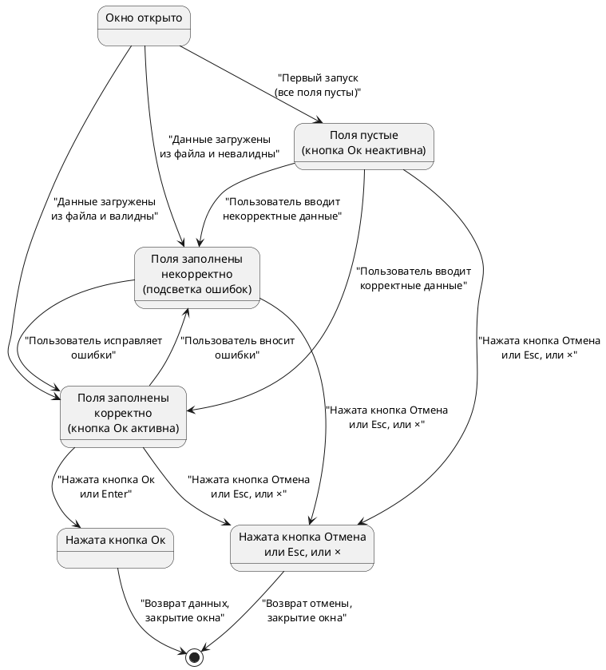

# Спецификация дизайна пользовательского интерфейса

**Версия:** 1.1 (итоговая)  
**Дата:** 2026-06-07  
**Автор:** Солодюк В.Л.  
**Проект:** ПО «AlphaMeterQC» / Модуль ввода идентификационных данных для подключения к БД  
**Домен:** Проектирование UI/UX

---

## 1. Введение

### 1.1 Цель документа
Описать визуальный макет (wireframe/mockup) графического интерфейса модуля `login_dialog`, включая расположение элементов, их размеры, стили, состояния и поведение. Документ является основой для разработки прототипа и проверки соответствия функциональным требованиям.

### 1.2 Область применения
Документ предназначен для разработчиков и тестировщиков при реализации графического интерфейса на базе CustomTkinter.

### 1.3 Источники требований
- Спецификация требований (SRS v2.9)
- Пользовательские истории (v2.3)
- Варианты использования (v5.6)
- Модель предметной сферы (v2.5)

---

## 2. Общий вид окна (Wireframe)

```
┌─────────────────────────────────────────────────────────────┐
│  Подключение к БД                                     [─][×] │
─────────────────────────────────────────────────────────────┤
│                                                             │
│  IP-адрес/хост:  ┌─────────────────────────────────────┐   │
│                  │ 192.168.1.10                        │   │
│                  └─────────────────────────────────────┘   │
│                                                             │
│  Порт:           ┌─────────────────────────────────────┐   │
│                  │ 1521                                │   │
│                  └─────────────────────────────────────┘   │
│                                                             │
│  Имя пользователя: ┌─────────────────────────────────────┐ │
│                    │ admin                               │ │
│                    └─────────────────────────────────────┘ │
│                                                             │
│  Пароль:         ┌─────────────────────────────────────┐   │
│                  │ ••••••••                            │   │
│                  └─────────────────────────────────────┘   │
│                                                             │
│  Идентификатор службы: ┌───────────────────────────────┐   │
│                        │ ORCL                          │   │
│                        └───────────────────────────────┘   │
│                                                             │
│  ┌─────────────────────────────────────────────────────┐   │
│  │                                                     │   │
│  │         [ Отмена ]              [ Ок ]              │   │
│  │                                                     │   │
│  └─────────────────────────────────────────────────────┘   │
│                                                             │
└─────────────────────────────────────────────────────────────┘
```

**Размеры окна:** 450×520 пикселей (ширина × высота)  
**Отступы:** 20 пикселей от краёв окна до элементов  
**Расстояние между полями:** 15 пикселей  
**Высота поля ввода:** 35 пикселей  
**Ширина поля ввода:** 380 пикселей  
**Высота кнопок:** 40 пикселей  
**Ширина кнопок:** 140 пикселей каждая

---

## 3. Описание элементов интерфейса

### 3.1 Заголовок окна

| Атрибут | Значение |
|---------|----------|
| Текст | **«Подключение к БД»** |
| Шрифт | CustomTkinter default, размер 16, жирный |
| Выравнивание | По центру |
| Высота | 40 пикселей |
| Цвет фона | Акцентный цвет темы (синий/тёмно-синий) |
| Цвет текста | Белый |

### 3.2 Поля ввода

#### Поле «IP-адрес/хост»

| Атрибут | Значение |
|---------|----------|
| Подпись (label) | «IP-адрес/хост:» |
| Тип | `CTkEntry` |
| Ширина | 380 пикселей |
| Высота | 35 пикселей |
| Шрифт | Размер 13 |
| Placeholder | «Введите IP-адрес или DNS-имя» |
| Значение по умолчанию | Пустая строка |
| Валидация | IPv4 (0.0.0.0 – 255.255.255.255) или DNS (строка после `strip()` должна содержать хотя бы один буквенно-цифровой символ, не начинаться и не заканчиваться на `-` или `.`, допустимые символы: латиница, цифры, `_`, `-`, `.`, не более 255 символов) |
| Порядок Tab | 1 |

#### Поле «Порт»

| Атрибут | Значение |
|---------|----------|
| Подпись (label) | «Порт:» |
| Тип | `CTkEntry` |
| Ширина | 380 пикселей |
| Высота | 35 пикселей |
| Шрифт | Размер 13 |
| Placeholder | «Введите номер порта (1–65535)» |
| Значение по умолчанию | «1521» |
| Валидация | Число от 1 до 65535 |
| Порядок Tab | 2 |

#### Поле «Имя пользователя»

| Атрибут | Значение |
|---------|----------|
| Подпись (label) | «Имя пользователя:» |
| Тип | `CTkEntry` |
| Ширина | 380 пикселей |
| Высота | 35 пикселей |
| Шрифт | Размер 13 |
| Placeholder | «Введите имя пользователя» |
| Значение по умолчанию | Пустая строка |
| Валидация | Не пустое, ≤ 30 символов (латиница, цифры, `_`, `-`) |
| Порядок Tab | 3 |

#### Поле «Пароль»

| Атрибут | Значение |
|---------|----------|
| Подпись (label) | «Пароль:» |
| Тип | `CTkEntry` (show="•") |
| Ширина | 380 пикселей |
| Высота | 35 пикселей |
| Шрифт | Размер 13 |
| Placeholder | «Введите пароль» |
| Значение по умолчанию | Пустая строка |
| Валидация | Не пустой (≥ 1 символа, любые символы) |
| Маскировка | Символ «•» (U+2022) |
| Порядок Tab | 4 |

#### Поле «Идентификатор службы»

| Атрибут | Значение |
|---------|----------|
| Подпись (label) | «Идентификатор службы (SID/Service Name):» |
| Тип | `CTkEntry` |
| Ширина | 380 пикселей |
| Высота | 35 пикселей |
| Шрифт | Размер 13 |
| Placeholder | «Введите идентификатор службы (опционально)» |
| Значение по умолчанию | «ORCL» |
| Валидация | ≤ 30 символов (латиница, цифры, `_`, `.`, `-`). Поле опционально. |
| Порядок Tab | 5 |

### 3.3 Кнопки

#### Кнопка «Ок»

| Атрибут | Значение |
|---------|----------|
| Текст | «Ок» |
| Тип | `CTkButton` |
| Ширина | 140 пикселей |
| Высота | 40 пикселей |
| Шрифт | Размер 14, жирный |
| Цвет фона (активна) | Акцентный цвет темы (зелёный/синий) |
| Цвет фона (неактивна) | Серый (#A9A9A9) |
| Цвет текста | Белый |
| Состояние по умолчанию | **Неактивна** (disabled) |
| Активация | Когда все обязательные поля валидны |
| Действие | Возврат данных вызывающей системе, сохранение параметров (кроме пароля) в файл, закрытие окна |
| Горячая клавиша | Enter (когда форма валидна) |
| Порядок Tab | 6 |

#### Кнопка «Отмена»

| Атрибут | Значение |
|---------|----------|
| Текст | «Отмена» |
| Тип | `CTkButton` |
| Ширина | 140 пикселей |
| Высота | 40 пикселей |
| Шрифт | Размер 14 |
| Цвет фона | Вторичный цвет темы (серый/тёмно-серый) |
| Цвет текста | Белый |
| Состояние | **Всегда активна** |
| Действие | Возврат сигнала отмены (`None`), закрытие окна без сохранения |
| Горячая клавиша | Esc |
| Порядок Tab | 7 |

---

## 4. Состояния элементов

### 4.1 Состояния полей ввода

| Состояние | Визуальное отображение | Описание |
|-----------|------------------------|----------|
| **Нормальное** | Белая рамка, чёрный текст | Поле пустое или содержит валидные данные |
| **Фокус** | Синяя рамка (2px), чёрный текст | Поле активно, пользователь вводит данные |
| **Ошибка** | Красная рамка (2px), красный текст | Содержимое не соответствует правилам валидации |
| **Заполнено из файла** | Светло-зелёная рамка (1px), чёрный текст | Значение загружено из файла сохранения (опционально) |

### 4.2 Состояния кнопок

| Состояние | Визуальное отображение | Описание |
|-----------|------------------------|----------|
| **Активна** | Яркий цвет фона, курсор pointer | Кнопка доступна для нажатия |
| **Неактивна** | Серый цвет фона, курсор default | Кнопка недоступна (только для «Ок») |
| **Нажата** | Тёмный оттенок фона | Визуальный отклик при клике |

---

## 5. Поведение и интерактивность

### 5.1 Валидация в реальном времени

- Валидация выполняется **при каждом изменении** содержимого поля (событие `KeyRelease` или `<<Modified>>`).
- При обнаружении ошибки:
  - Рамка поля становится **красной** (2px).
  - Кнопка «Ок» становится **неактивной** (если ещё не была).
  - Появляется **tooltip** с описанием ошибки (при наведении на поле).
- При исправлении ошибки:
  - Рамка поля возвращается к **нормальному** состоянию.
  - Если все поля валидны — кнопка «Ок» становится **активной**.

### 5.2 Навигация клавишей Tab

Порядок фокуса:
```
IP-адрес/хост → Порт → Имя пользователя → Пароль → Идентификатор службы → [Ок] → [Отмена]
```

- При нажатии `Tab` фокус переходит к следующему элементу.
- При нажатии `Shift+Tab` фокус переходит к предыдущему элементу.

### 5.3 Обработка клавиши Enter

- Если форма **валидна** (кнопка «Ок» активна):
  - Нажатие `Enter` в любом поле равносильно нажатию кнопки «Ок».
- Если форма **невалидна** (кнопка «Ок» неактивна):
  - Нажатие `Enter` **игнорируется**, окно не закрывается.

### 5.4 Обработка клавиши Esc

- Нажатие `Esc` в любом месте окна равносильно нажатию кнопки «Отмена».

### 5.5 Закрытие окна

- Закрытие через системную кнопку «×» равносильно нажатию кнопки «Отмена».

### 5.6 Умный фокус

При открытии окна:
- Если поле `ip` **или** `username` не пустое (заполнено из файла или передано как default) → фокус на поле **«Пароль»**.
- Иначе (первый запуск, все поля пусты) → фокус на поле **«IP-адрес/хост»**.

---

## 6. Цветовая схема (CustomTkinter)

Модуль поддерживает две темы: **Light** и **Dark**.

### 6.1 Светлая тема (Light)

| Элемент | Цвет |
|---------|------|
| Фон окна | #F5F5F5 (светло-серый) |
| Фон полей ввода | #FFFFFF (белый) |
| Рамка полей (нормальная) | #CCCCCC (серый) |
| Рамка полей (фокус) | #0078D4 (синий) |
| Рамка полей (ошибка) | #FF4444 (красный) |
| Текст полей | #000000 (чёрный) |
| Фон кнопки «Ок» (активна) | #0078D4 (синий) |
| Фон кнопки «Ок» (неактивна) | #A9A9A9 (серый) |
| Фон кнопки «Отмена» | #6C757D (тёмно-серый) |
| Текст кнопок | #FFFFFF (белый) |
| Заголовок окна | #0078D4 (синий) |

### 6.2 Тёмная тема (Dark)

| Элемент | Цвет |
|---------|------|
| Фон окна | #2B2B2B (тёмно-серый) |
| Фон полей ввода | #3C3C3C (серый) |
| Рамка полей (нормальная) | #555555 (серый) |
| Рамка полей (фокус) | #4CC2FF (голубой) |
| Рамка полей (ошибка) | #FF6B6B (красный) |
| Текст полей | #FFFFFF (белый) |
| Фон кнопки «Ок» (активна) | #4CC2FF (голубой) |
| Фон кнопки «Ок» (неактивна) | #555555 (серый) |
| Фон кнопки «Отмена» | #6C757D (тёмно-серый) |
| Текст кнопок | #FFFFFF (белый) |
| Заголовок окна | #4CC2FF (голубой) |

---

## 7. Адаптивность и масштабирование

- Окно имеет **фиксированный размер** (450×520 пикселей), изменение размера запрещено.
- При изменении DPI системы (например, 150% в Windows) элементы масштабируются пропорционально.
- Минимальное разрешение экрана: 1024×768 пикселей.

---

## 8. Соответствие требованиям

| Элемент UI | Требование SRS | Статус |
|------------|----------------|--------|
| 5 полей ввода с подписями на русском | F-1, SR-1 | ✅ |
| Кнопки «Ок» и «Отмена» | F-1, SR-1 | ✅ |
| Валидация в реальном времени (IPv4 + строгий DNS) | F-2, SR-2 | ✅ |
| Подсветка ошибок (красная рамка) | F-3, SR-3 | ✅ |
| Кнопка «Ок» неактивна при ошибках | F-4, SR-4 | ✅ |
| Кнопка «Отмена» всегда активна | F-4, SR-4 | ✅ |
| Возврат данных при «Ок» | F-5 | ✅ |
| Возврат отмены при «Отмена»/Esc/× | F-6 | ✅ |
| Маскировка пароля (символ «•») | F-11, SR-15 | ✅ |
| Значения по умолчанию (1521, ORCL) | F-9, F-13 | ✅ |
| Умный фокус (если `ip` или `username` не пустые) | NF-1 | ✅ |
| Навигация Tab | F-1 | ✅ |
| Игнорирование Enter при невалидной форме | F-4 | ✅ |
| Современный UI (CustomTkinter) | SR-1, US-1 | ✅ |

---

## 9. Диаграмма состояний интерфейса (PlantUML)



---

## 10. Изменения по сравнению с версией 1.0

| № | Изменение | Обоснование |
|---|-----------|-------------|
| 1 | **Заголовок окна:** Изменён с «Подключение к БД Oracle» на «Подключение к БД» | Принцип слабой связанности: модуль не зависит от конкретной СУБД |
| 2 | **Умный фокус:** Уточнено условие: «если `ip` **или** `username` не пустые» | Упрощение логики для реального ускорения ввода (User-Centric Design) |
| 3 | **Валидация DNS:** Добавлены строгие правила: `strip()`, запрет на `-`/`.` на краях, наличие буквенно-цифрового символа | Исключение невалидных строк вида `---` или `...` |
| 4 | **Пути файлов:** Удалены упоминания macOS, оставлены только Windows (`%LOCALAPPDATA%`) и Linux (`~/.config/`) | Фокусировка на целевых платформах проекта |
| 5 | **Атомарная запись:** Указано использование `os.replace` вместо устаревших методов | Упрощение кроссплатформенной реализации (принцип KISS) |