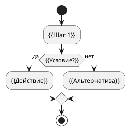
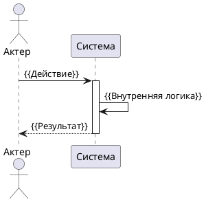

# Спецификация варианта использования «{{Название UC}}»

**ID:** {{UC.ID}} (например, UC.MODULE.D0.01)  
**Версия:** {{x.x}}  
**Дата:** {{YYYY-MM-DD}}  
**Автор:** {{Имя Фамилия}}  
**Проект:** {{Название проекта}}  
**Домен:** {{Бизнес-домен}}  

---

## 1. Введение

### 1.1 Цель
Краткое описание бизнес-цели сценария. Что должна сделать система и зачем это нужно пользователю/системе.

### 1.2 Источники требований
- {{Список документов, например: Концепция v3.4, ТЗС v2.5}}

---

## 2. Описание сценария

| Атрибут | Значение |
|---------|----------|
| **Название** | {{Краткое название действия}} |
| **Актеры** | **Главный:** {{Роль, инициирующая действие}} **Вовлеченные:** {{Внешние системы, суб-модули}} |
| **Предусловия** | 1. {{Условие 1}} 2. {{Условие 2}} |
| **Постусловия** | 1. {{Результат успеха}} 2. {{Состояние системы после завершения}} |
| **Описание** | {{Краткое текстовое описание логики процесса без привязки к UI, если это возможно}} |

---

## 3. Основной поток (Basic Flow)

| Шаг | Актор | Действие и логика системы |
|-----|-------|---------------------------|
| 1 | {{Актор}} | {{Описание действия}} |
| 2 | {{Система}} | {{Реакция системы, валидация, вызов API}} |
| ... | ... | ... |
| N | {{Система}} | {{Завершение сценария, возврат результата}} |

---

## 4. Альтернативные потоки и ошибки (Alternative Flows)

*Описываются только критические отклонения от основного потока.*

| ID | Ситуация | Реакция системы |
|----|----------|-----------------|
| A1 | {{Описание ошибки/альтернативы}} | {{Действия системы: откат, сообщение, переход к шагу X}} |
| A2 | {{...}} | {{...}} |

---

## 5. Диаграммы

### 5.1 Диаграмма деятельности (Activity)

### 5.2 Диаграмма последовательности (Sequence)

---

## 6. Покрытие требований (Traceability)

### 6.1 Функциональные требования (F)
| F-ID | Описание требования | Покрытие (Шаг/Альтернатива) |
|------|---------------------|-----------------------------|
| F-1 | {{Краткое описание}} | Шаг {{N}} |
| F-2 | {{...}} | Шаг {{N}} |

### 6.2 Нефункциональные требования (NF)
| NF-ID | Описание требования | Покрытие |
|-------|---------------------|----------|
| NF-1 | {{Производительность, безопасность, UX}} | {{Шаг/Раздел}} |

---

## 7. Связи с другими UC

| UC-ID | Название | Тип связи | Описание |
|-------|----------|-----------|----------|
| {{UC.X}} | {{Название}} | {{Предшествует/Включает}} | {{Кратко: что вызывает или вызывается}} |