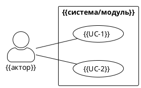

# ВАРИАНТЫ ИСПОЛЬЗОВАНИЯ (USE CASES)
**Модуль/Продукт:** {{название}}  
**Версия:** {{x.x}}  
**Дата:** {{YYYY-MM-DD}}  
**Автор:** {{роль/имя}}  
**Проект:** {{название проекта}}  
**Статус:** Черновик / На согласовании / Утверждена  
---
## 1. Область и контекст
{{Краткое описание бизнес-задачи, решаемой модулем/системой. Укажите ожидаемый эффект и чёткие границы: что входит в спецификацию, а что выходит за её рамки.}}

## 2. Действующие лица (Actors)
| ID | Роль / Актор | Описание и права |
|----|--------------|------------------|
| A-1 | {{роль}} | {{описание роли, уровень доступа, взаимодействие с системой}} |
| A-2 | {{роль}} | {{...}} |

## 3. Реестр вариантов использования
| ID | Название | Домен/Модуль | Актор | Тип |
|----|----------|--------------|-------|-----|
| UC.{{DOMAIN}}.{{SEQ}} | {{название}} | {{домен}} | {{актор}} | Пользовательский / Автоматический / Документирующий |

## 4. Детальное описание вариантов использования
### UC.{{DOMAIN}}.{{SEQ}} «{{название}}»
| Атрибут | Значение |
|---------|----------|
| **Описание** | {{суть действия, бизнес-ценность, что делает система без привязки к UI/коду}} |
| **Предусловия** | {{состояние системы, данные или действия, необходимые перед стартом}} |
| **Постусловия** | {{состояние системы после успешного завершения}} |
| **Основной сценарий** | 1. {{шаг}} 2. {{шаг}} 3. {{шаг}} |
| **Альтернативные/Исключительные сценарии** | {{условия отклонения, ошибки, ветвления, обработка граничных случаев}} |
| **Бизнес-правила** | {{правила валидации, ограничения, условия активации/деактивации}} |

## 5. Диаграмма и потоки выполнения

{{Краткое описание последовательности вызовов UC или высокоуровневый поток взаимодействия акторов и системы.}}

## 6. Матрица трассировки (RTM)
| UC ID | Связь с требованиями (SRS/FR/NFR) | Связь с тестами | Связь с архитектурой/ADR |
|-------|----------------------------------|-----------------|-------------------------|
| UC... | {{ID требования}} | {{ID теста/TC}} | {{ADR/Модуль/Компонент}} |
| UC... | {{...}} | {{...}} | {{...}} |

## 7. Допущения и ограничения
- **Допущение:** {{условие, принимаемое за истину без доказательств на данном этапе}}
- **Ограничение:** {{исключённый функционал, регуляторное, техническое или бизнес-ограничение}}
---
> **Примечание:** Документ фиксирует *«что»* и *«почему»* должна делать система. Детали реализации («как») описываются в ADR, спецификациях API и unit-тестах. При изменении требований обновляйте RTM, сценарии и версию документа.